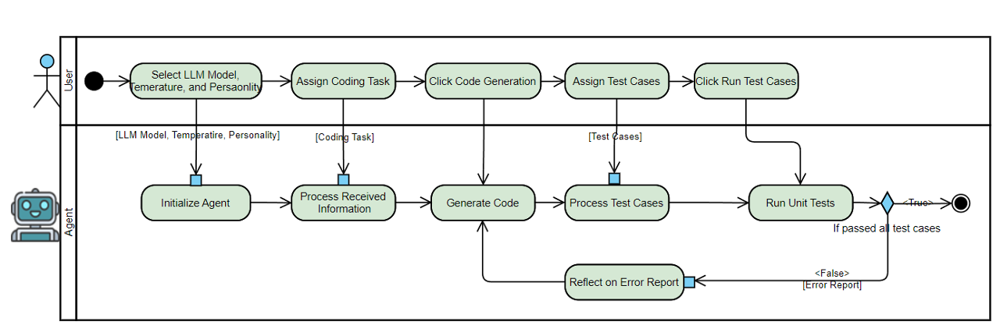

# PersonaCoder: Coding Agents with Personalities

## Abstract
The abstract for PersonaCoder will go here. Provide a concise summary of what the prototype does, its purpose, and how it leverages personality traits to influence coding abilities.

## Software Workflow
The following diagram illustrates the software workflow for PersonaCoder, showing how different components interact to generate personalized coding agents:

## Demo Video
Watch the video demonstration of the PersonaCoder prototype in action:

    <iframe src="https://www.loom.com/embed/1a31f7c869634244ad81572f3b8fc4c5?sid=cc148f46-4fdd-41da-9f63-ecd9db056275" frameborder="0" webkitallowfullscreen mozallowfullscreen allowfullscreen style="position: absolute; top: 0; left: 0; width: 100%; height: 100%;"></iframe>

