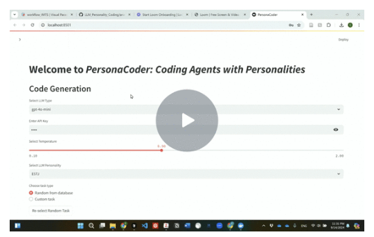

# PersonaCoder: Coding Agents with Personalities

## Abstract
This study introduces PersonaCoder, a prototype that assigns distinct personality types to LLM-based coding agents. The prototype was tested on coding tasks from the APPS benchmark to evaluate the influence of personality traits on agent performance. The results revealed that agents with sensing (S) and thinking (T) traits outperformed those with intuitive (N) and feeling (F) traits. However, the inclusion of a reflection mechanism significantly narrowed these performance gaps. These findings provide valuable insights into optimizing coding outcomes through personality traits and iterative learning, contributing to the design of more effective coding agents and expanding theoretical understanding of human coding behavior.

## Software Workflow

## Demo Video
Here’s a video demonstration of the prototype:

*Right-click on the image and select "Open link in new tab" to watch the video without leaving GitHub.*

